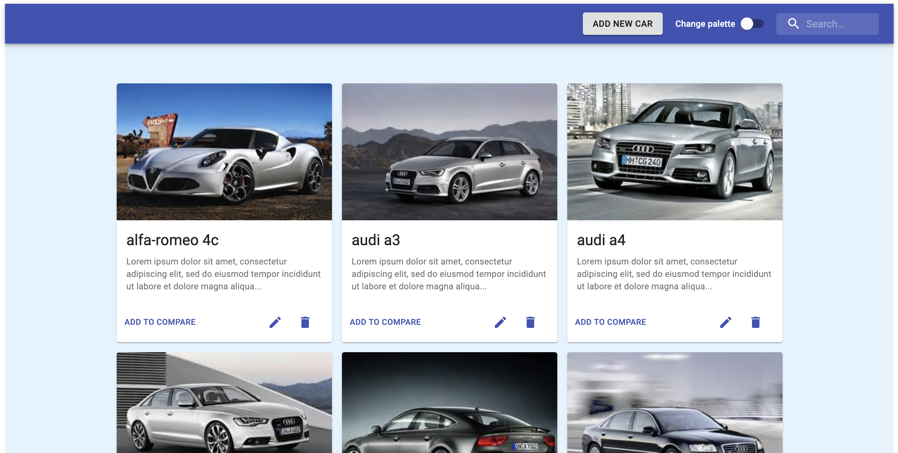
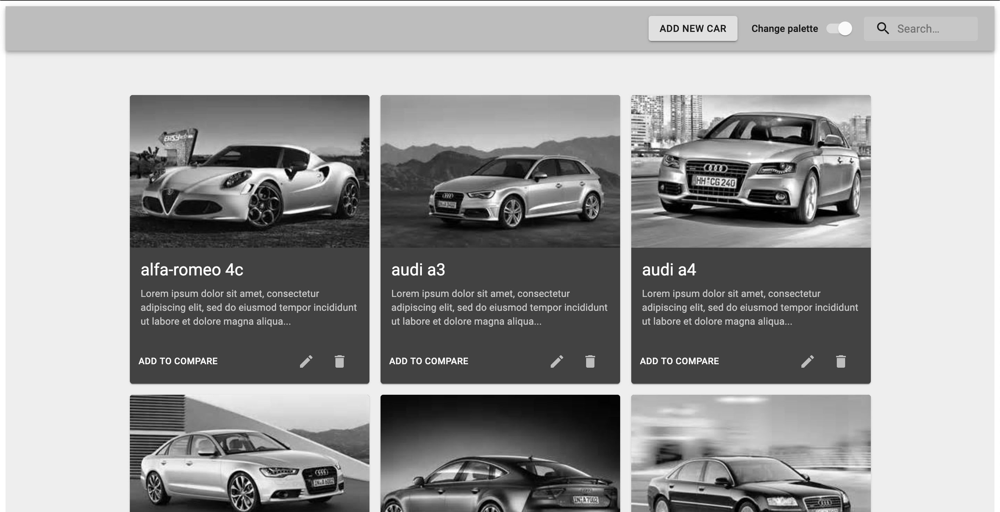
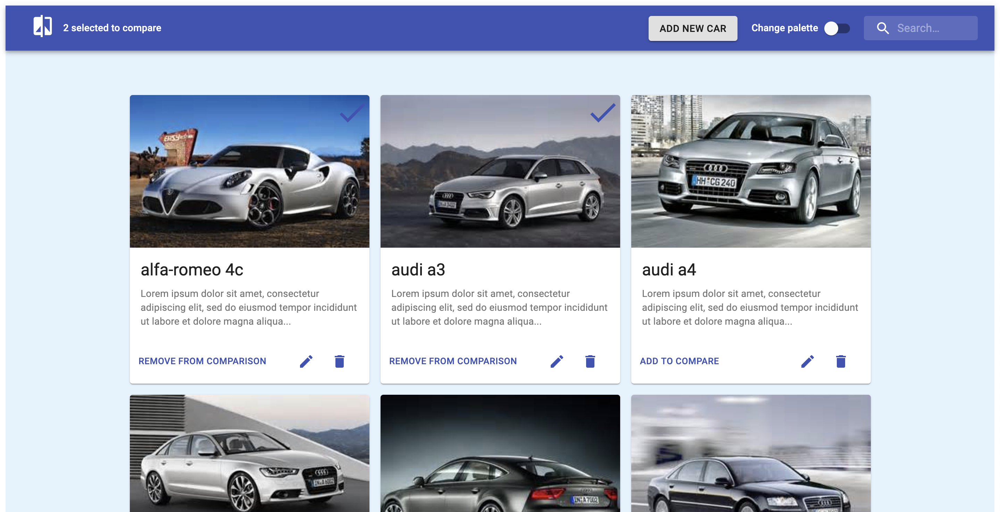
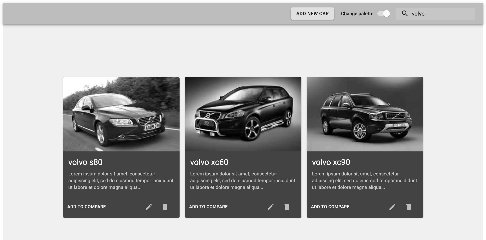

# code-creativity

Retrieve information about cars and displayed as a card list. Implement search and cars's comparison


## Summary

### Requirements

- Access to an external API. On this case, the server will run it locally using json-server
- CRUD methods.
- State manager. Used Redux as state management.
- TDD.
- Documentation. Created this markdown document as documentation.

### Comments

- This is not a typical CRUD example but I think has more value than that. On this exercise you can see different actions like select/unselect, dynamic searches and changes, routing, modals and responsive design.
- Used 'any' as typo in some parts of the code. This must be changed by their corresponding interfaces but missing due this is a PoC, I just create a couple of interfaces to show how must be done.
- Create more unit tests. All the components and reducers have their unit tests, in some cases I avoid to repeat the same action, the most remarkable tests will be 'CarDetails' component and 'Cars' reducer.

### Test coverage

Before to include CRUD operations (create, update and delete) into application, the test coverage was:


But, after include the CRUD operations, the percentatge was lower than expected. Must be improved in next steps.


## Exercise description

This exercise is based in a car comparison, that means that you can filter by name (using the search box located in the upper right corner) and add or remove cars for the comparison. Once you selected a car/s you can go to the comparison screen to see just them.

There are two more features, the first one is the 'change palette' option (located too in the upper right corner), to change from a 'standard' palette to a monochromatic palette. The other feature is a modal with a few more information about each car, to reach this screen just click on any car's image.

### Default behaviour

This is the main screen without any car selected for comparison



### Monochromatic behaviour



### Two cars selected

When you select a car, a 'check' icon will appear over the image and the option to remove it from comparion will appear.

In the upper left corner you can access to the comparison page



### Seach car

Used to filter the cars dinamically



### Car extended description modal window

If the user clicks on a car's card, a modal will showed with an extended description about the selected car.


### Add new car into car's list

In the upper right corner the button 'Add new car' allows user to create a new car.


### Update and delete buttons

On each car you will find two actions (in adittion to the add-remove to comparison) to update or delete a car from the list


#### Update car

The update car has the same look'n'feel that the create car window (are the same fields and validations)

#### Delete car

When the user clicks on the delete's button, a confirmation dialog will appear


### Comparison page

On this screen will appear the selected cars that the user choose. The options available on this this screen are these:

- Go back. Pressing the 'back' icon located in the upper left corner
- Change palette
- Car extended description modal window


## About the API data used

The cars.json, located in the server folder, was retrieved from the API endpoint: https://private-anon-f01e0dd1fc-carsapi1.apiary-mock.com/cars.

You can find more information about this API into [carsapi1.docs.apiary.io](https://carsapi1.docs.apiary.io/#reference/0/cars-collection/list-all-cars) to view it in the browser.

## Steps to run it locally

### Install dependencies

```sh
yarn
```

Launches the web application into the port 3000.<br />

### Run json-server

```sh
json-server ./server/cars.json -p 3001
```

Launches the json server into the port 3001.<br />

### Run react project

```sh
yarn start
```

## Available Scripts

In the project directory, you can run:

### `yarn start`

Runs the app in the development mode.<br />
Open [http://localhost:3000](http://localhost:3000) to view it in the browser.

The page will reload if you make edits.<br />
You will also see any lint errors in the console.

### `yarn test`

Launches the test runner in the interactive watch mode.<br />

### `yarn test:cov`

Launches the test coverage in the interactive watch mode.<br />

### `yarn build`

Builds the app for production to the `build` folder.<br />
It correctly bundles React in production mode and optimizes the build for the best performance.

The build is minified and the filenames include the hashes.<br />
Your app is ready to be deployed!
